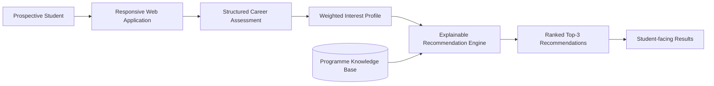
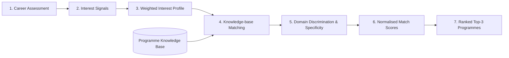

# Tshwi Advisor — AI-Powered Career Advisor

**Tshwi Advisor** is a production-deployed career guidance platform designed for prospective students of **Tshwane College of Commerce, Engineering and Technology**. It uses an explainable, knowledge-based AI recommendation approach to translate a structured career assessment into ranked programme matches.

> **Portfolio repository:** This repository documents the architecture, AI methodology, privacy/security design, testing strategy and production-engineering approach. The production source code, operational configuration, administrative implementation, credentials and user data are intentionally not published here.

## Live application

**Tshwi Advisor:** https://www.tshwiadvisor.co.za/

## What the system does

1. A prospective student completes a structured career-interest assessment.
2. The system derives a weighted interest profile from the selected answers.
3. A deterministic inference layer compares that profile with a curated programme knowledge base.
4. Programme fit is calculated using weighted interest alignment and domain-specific matching.
5. The three strongest matches are returned with match percentages and programme information.

The system is deliberately **explainable and deterministic**. It does not claim to use a trained predictive model or generative AI to make admission decisions.

## Architecture

The production platform additionally contains protected administrative, persistence, privacy and security services that are documented here only at an appropriate architectural level.

See the [full system architecture](docs/ARCHITECTURE.md).

## AI recommendation pipeline

## AI methodology

Tshwi Advisor is best characterised as an **explainable, knowledge-based AI recommendation system**. The recommendation pipeline combines:

- structured assessment responses;
- weighted interest-profile construction;
- curated programme-domain knowledge;
- deterministic matching rules;
- domain-discrimination signals;
- specificity weighting; and
- ranked recommendation output.

This design was chosen so that recommendations remain reproducible, auditable and understandable rather than depending on opaque model behaviour.

See [AI Methodology](docs/AI-METHODOLOGY.md).

## Production engineering

The application was taken through a complete engineering lifecycle:

**requirements → architecture → implementation → automated testing → recommendation validation → privacy/security hardening → synthetic load testing → cloud deployment → live acceptance testing → release engineering**

The production baseline was formally established as **Tshwi Advisor v1.0.0** in September 2026.

## Validation

Validation included:

- automated backend and recommendation tests;
- multi-persona synthetic recommendation validation;
- production acceptance testing of the complete anonymous quiz journey;
- consent enforcement testing;
- production verification that anonymous recommendation requests are not persisted as leads;
- administrative authentication and access checks;
- desktop and mobile UI acceptance testing; and
- dedicated synthetic load testing.

A dedicated load-test deployment processed **250 concurrent simulated users without functional failures**. Tail latency increased on deliberately small free-tier test infrastructure, so this is reported as a reliability observation rather than a production-capacity guarantee.

See [Testing and Validation](docs/TESTING-AND-VALIDATION.md).

## Privacy and security

The platform follows privacy-by-design and data-minimisation principles:

- contact details are optional for course matching;
- anonymous quiz submissions are not persisted as leads;
- optional adult contact submission requires explicit consent;
- protected administrative access is role-controlled;
- authentication, trusted-origin controls, rate limiting and bounded input validation are applied in production; and
- operational data and secrets are kept outside this public repository.

The implementation is described as **POPIA-aligned by design**; this does not replace the institution's formal governance obligations.

See [Privacy and Security](docs/PRIVACY-AND-SECURITY.md).

## Technology stack

The production system uses a modern TypeScript web stack, including **Next.js**, **Node.js/Express**, **PostgreSQL**, **Prisma**, cloud-hosted frontend/backend services, GitHub-based source control and CI workflows, and **k6** for synthetic load testing.

This portfolio intentionally omits security-sensitive deployment details.

## Application showcase

The live application includes the student-facing homepage, structured career assessment, ranked recommendation results, programme catalogue and responsive mobile experience. To protect the integrity of this portfolio, screenshots will only be added from the **actual deployed application** rather than reconstructed or illustrative interfaces.

> **Screenshot policy:** no real student/lead information, administrative records, credentials or other personal information will be published.

## Public portfolio contents

| Document | Purpose |
|---|---|
| [Architecture](docs/ARCHITECTURE.md) | Logical architecture and component responsibilities |
| [AI Methodology](docs/AI-METHODOLOGY.md) | Recommendation logic and explainability |
| [Privacy and Security](docs/PRIVACY-AND-SECURITY.md) | Privacy-by-design and security principles |
| [Testing and Validation](docs/TESTING-AND-VALIDATION.md) | Verification and performance evidence |
| [Production Engineering](docs/PRODUCTION-ENGINEERING.md) | Delivery lifecycle and release discipline |
| [Synthetic Example](examples/synthetic-recommendation-example.json) | Non-production illustrative output |

## Repository boundary

This repository is a **portfolio artefact, not the production application source repository**. It contains no production credentials, private administrative code, production database contents, real student/lead records, environment files or operational secrets.

## Project status

**Production baseline:** v1.0.0  
**Status:** Deployed and operational  
**Portfolio date:** September 2026

## Author

**Peter Olujimi**  
AI systems, applied research and educational technology

---

*Tshwi Advisor demonstrates the application of explainable AI, software engineering, privacy-by-design and production deployment to career guidance in the South African TVET context.*
