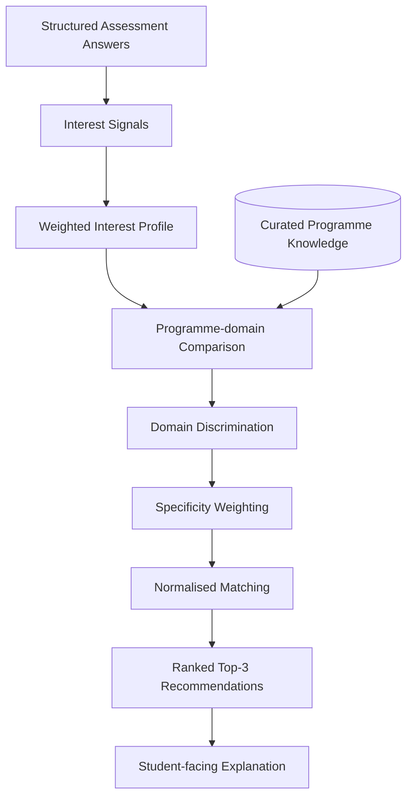

# System Architecture

## Architectural objective

Tshwi Advisor separates the student interaction layer, recommendation logic, programme knowledge, persistence and protected administration so that the career-guidance function remains explainable and maintainable.

## Logical architecture

 ```mermaid
flowchart LR
    U[Prospective Student] --> UI[Responsive Web Application]
    UI --> API[Application / API Layer]
    API --> V[Validation & Request Controls]
    V --> RE[Recommendation Engine]
    KB[(Programme Knowledge Base)] --> RE
    RE --> OUT[Ranked Explainable Results]

    API --> AUTH[Protected Authentication & Authorisation]
    AUTH --> ADMIN[Administrative Functions]
    API --> P[(Persistence Services)]

    classDef protected stroke-dasharray: 5 5;
    class AUTH,ADMIN,P protected;
```

### Recommendation path



## Design principles

### Separation of concerns
Student-facing presentation is separated from recommendation and persistence responsibilities.

### Explainability
Recommendation behaviour is deterministic and based on explicit profile-to-programme relationships.

### Data minimisation
A student can obtain recommendations without submitting contact details.

### Defence in depth
The production application combines input validation, authentication, authorisation, origin controls, rate limiting and secure session handling.

### Deployment independence
Frontend, API and database responsibilities are separable, supporting independent scaling and operational management.

## Public boundary

This document deliberately describes the system at logical architecture level. Endpoint inventories, credential handling, administrative implementation details, database connection information and operational configuration are excluded.
